# Ray Tracer

Ray tracing is a rendering technique that can realistically simulate the lighting of a scene and its objects by rendering physically accurate reflections, refractions, shadows, and indirect lighting. It is known to be less efficient but can producer more photo-real graphics compared to the [rasterizer](../mp1/README.md). It does so by simulating actual light rays and ray collisions with objects in the scene.

This application is a - from the scratch, bare bones ray tracer to create 3D imagery using [ray tracing](https://cs418.cs.illinois.edu/website/text/rays.html). It takes in .txt images similar to the rasterizer and produces images. The .txt files contain information about the scene ***(the location/size/shape/texture of the objects, the location and type of the light source etc)*** and trace light rays from the source to create objects, reflections, shadows etc.

For more information check this open ended [prompt](https://cs418.cs.illinois.edu/website/hw-raytracer.html).

Some example ray tracer images created:
| Ray Tracer Effect | Ray Tracer Text Input | Ray Tracer Generated Image |
|-------------------|-------------------|-------------------|
| Add a sphere with center (x,y,z)(x,y,z) and radius r r to the list of objects to be rendered. The sphere should use the current color as its color          | png 100 50 mpray_sphere.png sphere 0 0 -1 0.3 sphere 1 0.8 -1 0.5  | 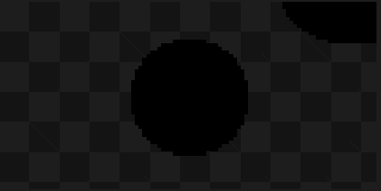 |
| Add a sun light infinitely far away in the (x, y, z) (x, y, z) direction. That is the direction to light vector in the lighting equation is (x, y, z) (x, y, z) no matter where the object is. Use the current color as the color of the sunlight. For the required part you only need to be able to handle scenes with zero light sources and scenes with one light source. | png 100 80 mpray_sun.png sphere 1 -0.8 -1 0.5 sphere 0 0 -1 0.3 sun 1 1 1 | 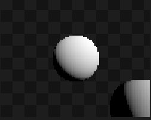 |
|Defines the current color to be rr gg bb, specified as floating-point values; (0,0,0) is black, (1,1,1) is white, (1,0.5,0) is orange, etc. You only need to track one color at a time. If no color has been seen in the input file, use white. You’ll probably need to map colors to bytes to set the image. First change colors ≤ 0.0 to 0 and colors ≥ 1 to 1; then apply a gamma function; then scale up linearly to the 0–255 byte range. The exact rounding used is not important.| png 100 80 mpray_sun.png sphere 1 -0.8 -1 0.5 sphere 0 0 -1 0.3 sun 1 1 1 | 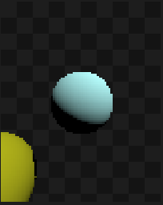 | 
|Rays should hit the closest object even if there are several overlaping.| png 100 80 mpray_overlap.png color 1 0 0 sphere 0 0 -1 0.3 color 0 1 0 sphere .1 -.2 -1.2 0.5 color 0 0 1 sphere -.5 -.8 -3 1 color 1 1 1 sphere 0.2 -0.2 -.5 0.05 color 1 1 1 sun -1 -0.5 1 | 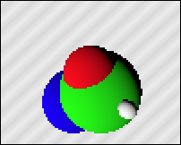 | 
|Your computations should be in a linear color space, converted to sRGB before saving the image. This is reflected in the colors of every reference image on this page. Don’t find intersections behind the ray origin.| png 80 100 mpray_behind.png color 1 1 1 sphere 0 0 1 0.3 color 1 0.5 0 sphere -1 -0.8 -1 0.5 color 0.5 1 1 sun 1 2 1 | 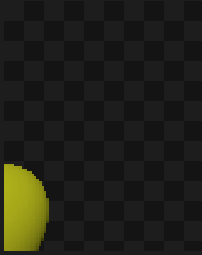 | 
|Spheres should cast shadows on other spheres. Self-shadowing (sometimes called shadow acne) is a problem with many shadow implementations. You should avoid that either with ray origin object IDs (i.e. shadow rays cannot see the sphere that generated them) or collision biases (i.e. shadow rays cannot see objects until they get a millionth of a unit away from their origin).| png 120 120 mpray_shadow-basic.png sun 0 2 1 sphere 0 .5 -1 0.2 sphere -.3 0 -1.25 0.3 sphere 0 -2 -2.5 1.3 | 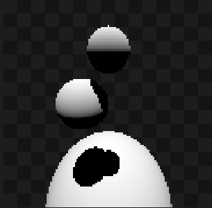 | 
|If you add more types of geometry and lights, shadow casting becomes more complicated.| png 120 120 mpray_shadow-bulb.png bulb 0 0 -1 sphere -.8 .3 -1 0.3 sphere -0.4 0 -1 0.2 sphere  0.4 0 -1 0.2 sphere .8 .3 -1 0.3 color 1 0 0 bulb 0 -.5 -.8 |  | 
|More types of geometry and lights|png 120 120 mpray_shadow-suns.png color 1 0 1 sun 0 2 1 color 0 1 1 sun .2 1 1 color 1 1 1 sphere 0 .5 -1 0.2 color 0.5 1 0.5 sphere -.3 0 -1.4 0.3 color 1 0 1 sphere 0 -2 -2.5 1.3 | 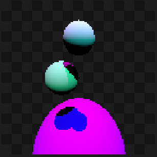 | 
|More types of geometry and lights|png 120 120 mpray_shadow-triangle.png sun 0 2 1 sphere 0 .5 -1 0.2 sphere -.3 0 -1.25 0.4 sphere 0 -2 -2.5 1.3 plane 0 1 0 1 plane 0.8 0.6 0 1 xyz .2 -.2 -1.2 xyz .8 .7 -1.1 xyz .6 .1 -1 trif 1 2 3 xyz .8 0 -1.2 xyz 0 .3 -1.1 xyz .4 -.3 -1 trif -1 -2 -3 | 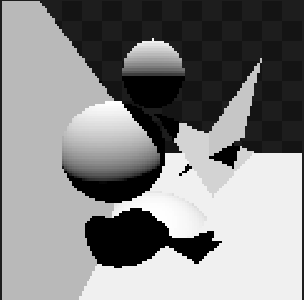 | 
|More types of geometry and lights|png 120 120 mpray_shadow-plane.png sun 0 2 1 sphere 0 .5 -1 0.2 sphere -.3 0 -1.25 0.4 sphere 0 -2 -2.5 1.3 plane 0 1 0 1 plane 0.8 0.6 0 1 | 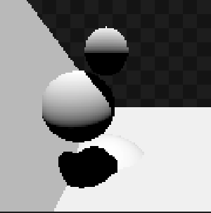 | 
|Allow an unlimited number of sun commands; combine all of their contributions |png 100 80 mpray_suns.png sphere 1 -0.8 -1 0.5 sphere 0 0 -1 0.3 color 0.5 0 0 sun 1 1 1 color 0 1 0 sun -2 0 -1 color 0 0 1 sun 0 -3 1 | 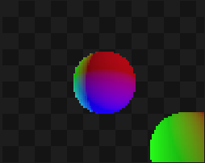 | 
|Add a point light source centered at (x, y, z). Use the current color as the color of the bulb. Handle as many bulbs and suns as there are in the scene. Include fall-off to bulb light: the intensity of the light that is d units away from the illuminated point is 1/d^2. |png 120 120 mpray_bulb.png sphere 0 0 -1 0.3 bulb 1 .1 0 sun -1 0 0 color 0 0.05 0 bulb 0 0 -.6 | 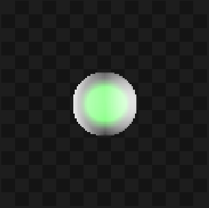 | 
| Allow light colors to be less than zero, emitting darkness. |png 100 100 mpray_neglight.png sphere 0 0 -1 0.3 color 1 0.8 0.6 sphere 0 -3.3 -5 5 color 1 1 1 sun 1 1 1 color -1 -.3 -.1 bulb 1 0 -1 color 0 0 8 bulb -1 .1 -1.3 | 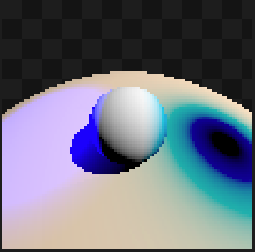 | 
|Render the scene with an exposure function, applied prior to gamma correction. Use a simple exponential exposure function: ℓ_exposed = 1 - e^(-ℓ_linear/v).|png 100 80 mpray_expose2.png expose 4 color 0.5 0 0 sphere 0 0 -1 0.3 color 0 0.25 0 sphere .1 -.2 -1.2 0.5 color 0 0 1 sphere -.5 -.8 -3 1 color 1 1 1 sphere 0.2 -0.2 -.5 0.05 color 3 3 3 sun -1 -0.5 1 | 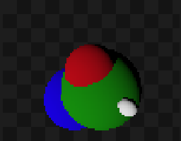 | 
|Same as above with a stronger degree of exposure.|png 100 80 mpray_expose1.png expose 0.5 color 0.5 0 0 sphere 0 0 -1 0.3 color 0 0.25 0 sphere .1 -.2 -1.2 0.5 color 0 0 1 sphere -.5 -.8 -3 1 color 1 1 1 sphere 0.2 -0.2 -.5 0.05 color 3 3 3 sun -1 -0.5 1 | 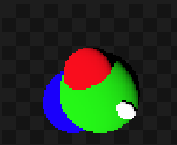 | 
| Change the eye location used in generating rays.|png 120 120 mpray_eye.png color 1 0 0 sphere 0 0 2 0.3 color 0 1 0 sphere .1 -.2 1.2 0.5 color 0 0 1 sphere -.5 -.8 0 1 color 1 1 1 sphere 0.2 -0.2 .5 0.05 color 1 1 1 sun -1 -0.5 1 eye 0 0 4 | 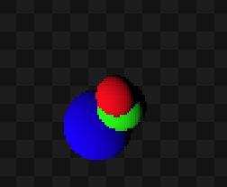 | 
|Change the forward direction used in generating rays. Then change the up and right vectors to be perpendicular to the new forward. Keep up as close to the original up as possible. The usual way to make a movable vector m perpendicular to a fixed vector f is to find a vector perpendicular to both (p = f x m) and then change the movable vector to be perpendicular to the fixed vector and this new vector (m' = p × f).|png 120 120 mpray_forward.png forward .4 -.5 -3 sun 0 1 1 sphere 0 0 -1 0.3 sphere .4 -.3 -1 0.1 | 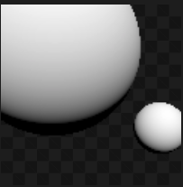 | 
|Change the up direction used in generating rays. Don’t use the provided up directly; instead use the closest possible up that is perpendicular to the existing forward. Then change the right vector to be perpendicular to forward and up. |png 120 120 mpray_up.png forward .4 -.5 -3 sun 0 1 1 sphere 0 0 -1 0.3 up 1 0 -0.3 sphere .4 -.3 -1 0.1 | 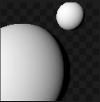 | 
|Find the ray of each pixel differently; in particular, divide sx and sy by the length of forward, and thereafter use a normalized forward vector for this computation. Let r^2 = sx^2 + sy^2. If r > 1, then don’t shoot any rays; otherwise, use sx right, sy up, and √(1 − r^2) forward.|png 100 100 mpray_fisheye.png sun 0.5 1 1 color   1  0  0 sphere  1 -1 -1  0.3 color   1  1  0 sphere  1  1 -1  0.4 color   0  1  0 sphere -1  1 -1  0.5 color   0  1  1 sphere -1  1  1  0.6 color   0  0  1 sphere -1 -1  1  0.7 color   1  0  1 sphere  1 -1  1  0.8 color   1  1  1 sphere  0 -4.7  -1   4 fisheye |  | 
|Defines the plane that satisfies the equation Ax + By + Cz + D = 0. It is common to have spurious shadows near the horizon of planes; the reference image shows an example of this just to the left of the sphere. These can be removed with more careful handling of shadow acne, but doing so is not required for this assignment.|png 100 100 mpray_plane.png sphere 0 0 -1 0.5 plane 0 1 0 0.5 plane 1 2 0.1 4 sun 1 1 1 | 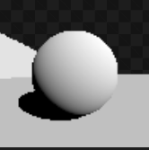 | 
|Add xyz and trif commands, with the same meaning as in the rasterizer assignment (except ray-traced, not rasterized).|png 100 100 mpray_trif.png xyz 0 -.6 -1 sphere 0 -.6 -1 0.1 xyz -.7 .3 -1.2 sphere -.7 .3 -1.2 0.1 xyz .8 .5 -0.9 sphere .8 .5 -0.9 0.1 trif 1 2 3 xyz -.7 -.7 -.8 color 1 0.5 0 trif 1 2 4 color 1 1 1 sun -1 -1 2 | 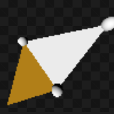 | 
