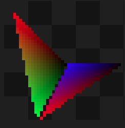
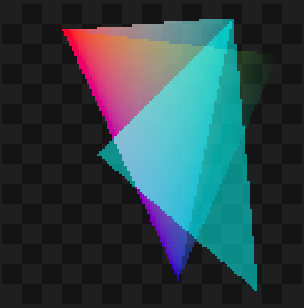
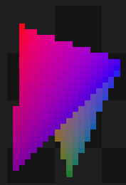
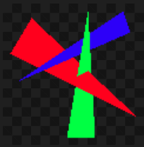
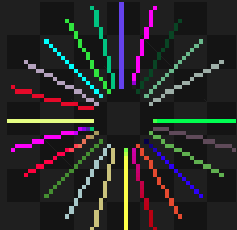

## Rasterizer

This is a simple bare bones rasterizer application written in Python. The application takes .txt files as input and creates corresponding .png image files using DDA and Scanline algorithms (involves repeated invocations of DDA) and gamma correction mechanisms to interpolate the pixels. The text files contain instructions to create an image - like positions of vertices, the colors etc - check problem description [here](https://cs418.cs.illinois.edu/website/hw-rasterize.html).

Some example rasterizer images created:
| Rasterizer Input | Rasterized Image |
|-------------------|-------------------|
| png 20 30 mp1indexing.png xyzw   1  3.5  3 4 xyzw  -1 -2   -3 4 rgb 0 0 0 xyzw   2  0    0 2 tri 1 -1 2 xyzw  -1  0.5  0 1 tri 1 -2 -1 |  |
| png 20 30 mp1req1.png  rgb 255 0 0  xyzw -12 -12 0 15 rgb 0 127 0 xyzw 0 14 0 15 rgb 0 0 255 xyzw 13.5 -6 0 15 tri 1 -1 2 rgb 119 0 153  xyzw -15 14 0 15 tri 1 -2 -1 |  |
| png 40 40 mp1req2.png rgb 255 0 0 xyzw -8.9 -8.85 0 10 rgb 0 255 0 xyzw -4.8 9.75 0 10 rgb 0 0 0 xyzw 0.3 0.35 0 10 tri 1 2 3 rgb 255 0 0 xyzw -4.3 9.75 0 10 rgb 0 0 255 xyzw 0.55 0.1 0 10 rgb 0 0 0 xyzw 9.9 0.1 0 10 tri 4 5 6  |  | 
| png 120 120 mp1rgba.png sRGB rgb 255 0 0 xyzw -36.0 -50.0 0 60 rgba 0 255 0 0.0 xyzw 50.0 -40.0 0 60 rgba 0 0 255 0.5 xyzw 10.0 50.0 0 60 rgba 0 255 255 0.5 xyzw -22.0 0.0 0 60 xyzw 32.0 -55.0 0 60 xyzw 42.0 55.0 0 60 tri 1 3 5 tri 1 2 3 tri -1 -2 -3  |  | 
| png 20 30 mp1srgb.png sRGB rgb 255 0 0 xyzw -12 -12 0 15 rgb 0 127 0 xyzw 0 14 0 15 rgb 0 0 255 xyzw 13.5 -6 0 15 tri 1 -1 2 rgb 119 0 153 xyzw -15 14 0 15 tri 1 -2 -1 |  | 
| png 120 120 mp1cull.png cull rgb 255 0 0 xyzw -0.8 -0.8 0.5 1 xyzw  0.8 -0.8 0.5 1 xyzw  0.0  0.8 0.5 1 tri 1 2 3 rgb 0 255 0 xyzw -0.7 -0.7 0.4 1 xyzw  0.9 -0.7 0.4 1 xyzw  0.1  0.9 0.4 1 tri 5 4 6  |  | 
| png 120 120 mp1depth.png depth rgb 255 0 0 xyzw -0.9 -0.3 1 1 xyzw -0.6 -0.8 1 1 xyzw  0.9  0.6 0 1 tri -1 -2 -3 rgb 0 255 0 xyzw -0.1  0.9 1 1 xyzw  0.3  0.9 1 1 xyzw  0.2 -0.9 0 1 tri -1 -2 -3 rgb 0 0 255 xyzw  0.7 -0.9 1 1 xyzw  0.8 -0.6 1 1 xyzw -0.8  0.1 0 1 tri -1 -2 -3  |  | 
| png 55 55 mp1line.png rgb 150 173 30 xyzw 0.25 0.0 0 1 rgb 121 228 31 xyzw 1.0 0.0 0 1 line -2 -1 rgb 94 75 89 xyzw 0.24148145657226708 0.06470476127563018 0 1 xyzw 0.9659258262890683 0.25881904510252074 0 1 line -2 -1 rgb 102 174 68 xyzw 0.21650635094610968 0.12499999999999999 0 1 xyzw 0.8660254037844387 0.49999999999999994 0 1 line -2 -1 rgb 148 212 3 xyzw 0.1767766952966369 0.17677669529663687 0 1 rgb 16 7 34 xyzw 0.7071067811865476 0.7071067811865475 0 1 line -2 -1 rgb 227 83 33 xyzw 0.12500000000000003 0.21650635094610965 0 1 xyzw 0.5000000000000001 0.8660254037844386 0 1 line -2 -1 rgb 205 158 199 xyzw 0.06470476127563018 0.24148145657226708 0 1 rgb 204 92 189 xyzw 0.25881904510252074 0.9659258262890683 0 1 line -2 -1 rgb 21 90 219 xyzw 1.5308084989341915e-17 0.25 0 1 rgb 74 196 128 xyzw 6.123233995736766e-17 1.0 0 1 line -2 -1 rgb 203 194 116 xyzw -0.06470476127563016 0.24148145657226708 0 1 xyzw -0.25881904510252063 0.9659258262890683 0 1 line -2 -1 rgb 168 199 201 xyzw -0.12499999999999994 0.21650635094610968 0 1 xyzw -0.4999999999999998 0.8660254037844387 0 1 line -2 -1 rgb 75 141 36 xyzw -0.17677669529663687 0.1767766952966369 0 1 xyzw -0.7071067811865475 0.7071067811865476 0 1 line -2 -1 rgb 201 137 83 xyzw -0.21650635094610968 0.12499999999999999 0 1 rgb 139 175 88 xyzw -0.8660254037844387 0.49999999999999994 0 1 line -2 -1 rgb 64 59 160 xyzw -0.24148145657226705 0.06470476127563025 0 1 rgb 5 211 89 xyzw -0.9659258262890682 0.258819045102521 0 1 line -2 -1 rgb 232 252 114 xyzw -0.25 3.061616997868383e-17 0 1 xyzw -1.0 1.2246467991473532e-16 0 1 line -2 -1 rgb 228 43 28 xyzw -0.24148145657226708 -0.0647047612756302 0 1 xyzw -0.9659258262890683 -0.2588190451025208 0 1 line -2 -1 rgb 179 162 190 xyzw -0.2165063509461097 -0.12499999999999993 0 1 xyzw -0.8660254037844388 -0.4999999999999997 0 1 line -2 -1 rgb 75 183 192 xyzw -0.17677669529663698 -0.17677669529663678 0 1 rgb 117 0 58 xyzw -0.7071067811865479 -0.7071067811865471 0 1 line -2 -1 rgb 71 225 18 xyzw -0.1250000000000001 -0.2165063509461096 0 1 xyzw -0.5000000000000004 -0.8660254037844384 0 1 line -2 -1 rgb 0 192 124 xyzw -0.06470476127563016 -0.24148145657226708 0 1 xyzw -0.25881904510252063 -0.9659258262890683 0 1 line -2 -1 rgb 92 71 243 xyzw -4.592425496802574e-17 -0.25 0 1 xyzw -1.8369701987210297e-16 -1.0 0 1 line -2 -1 rgb 129 6 193 xyzw 0.06470476127563007 -0.2414814565722671 0 1 rgb 10 33 0 xyzw 0.2588190451025203 -0.9659258262890684 0 1 line -2 -1 rgb 15 67 33 xyzw 0.12500000000000003 -0.21650635094610965 0 1 xyzw 0.5000000000000001 -0.8660254037844386 0 1 line -2 -1 rgb 110 182 137 xyzw 0.17677669529663684 -0.17677669529663692 0 1 xyzw 0.7071067811865474 -0.7071067811865477 0 1 line -2 -1 rgb 158 174 167 xyzw 0.2165063509461096 -0.1250000000000001 0 1 xyzw 0.8660254037844384 -0.5000000000000004 0 1 line -2 -1 rgb 58 28 207 xyzw 0.24148145657226702 -0.06470476127563039 0 1 rgb 91 130 33 xyzw 0.9659258262890681 -0.25881904510252157 0 1 line -2 -1  |  | 
